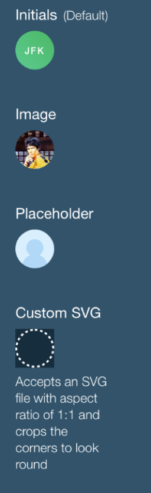

# Avatar

Avatar is a type of element that visually represents a user. It renders one of the following content types: image, icon or text (initials).
<br><br>

## Elements

Elements are "container" and "content". The conent could be classified to either "text", "image" or "icon".

## Use Cases
>When stating user crendentials we mean : name, icon (loaded) or imageUrl.

| Consumer scenario | Consumer display options | Image loading | Image loaded |
|-------------------|-------------------|--|--|
| no credentials | Placeholder: [ text \| icon \|  image ] | altContent
| credentials - no imageUrl   | [ text \| icon ] |
| credentials - with imageUrl  | [ text \| icon \|  image ] | altContent | Image |

> altContent - may be [ text | icon |  image ]

## API

#### Component Props

| name     | type                | defaultValue | isRequired | description          |
| -------- | ------------------- | ------------ | ---------- | --------------------------------------------------------------------- |
| name | string |  |  | Usually the user's name. Will be used to generate defaults for: text content, the html `title` attribute and `aria-lable` attribute of the root element. |
| initials | string | toInitials(props.name) | | Text to be rendered as content, usually initials of the name. Also acts as a fallback while the image is loading (in case there is `icon` is undefined) |
| icon | JSXElement | | | Icon content. Also acts as a fallback while the image is loading |
| imgProps | Omit<HTMLImageAttributes,'alt'> |              |            | Image props, in particular image src url |
| title | string | props.name   | | If undefined but `name` exists, then defaults to value of `name`
| aria-label | string | "Avatar for ${props.name}"| | |
| tabIndex | number | 0 | | |

## Name / title / aria-label

- `name` prop is used for default values for `title`, `aria-label` and text content.
- Consumer can use `{...other}` to pass `title` and `aria-label`, in order to override default values.


## Content fallback

- The `altContent` will be rendered in case the primary content is an image (`imgProps` passes), and it hasn't been loaded or had a load error.
- The `altContent` can be either a text or an icon (or any node).

## Auto Initials
name conversion examples:
<br/> John Doe --> JD
<br/> John H. Doe --> JHD
<br/> John Hurley Stanley Kubrik Doe --> JHD

## Technical Considerations

The component will fallback to a different content prop in case the image provided didn't load. For this to happen an `onError` handler will be used on the `img` tag. If a user provided an `onError` handler in `imgProps`, it will be called as well.<br>

<br> The `alt` property is omitted from `imgProps` interface. Placeholder will be used as `alt` instead.<br>

<br>additional behaviors (such as tooltip, dropdown, focus, click, etc.) should be implemented in wrappers. Examples TBD

### React Code Example

**Example 1:**

```jsx
//code example goes here
import * as React from 'react';
import { Avatar } from 'wix-ui-core/Avatar';
import { AvatarIcon } from 'my-icons/AvatarIcon';
import style from './style.st.css'; // link to Style file - see examples of style files below

export class ComponentsDemo extends React.Component<{}, {}>{

    render() {
        return (
            <div>
                <Avatar
                    className={style.avatar}
                    name="John Doe"
                    imgProps={{
                        srcset="elva-fairy-320w.jpg 320w, elva-fairy-800w.jpg 800w"
                        sizes="(max-width: 320px) 280px, 800px"
                        src="elva-fairy-800w.jpg"
                    }}
                    icon={<AvatarIcon/>}
                    />
            </div>
        )
    }
}
```

## Style API

#### Subcomponents (pseudo-elements)

| selector          | description                        | type | children pseudo-states |
| ----------------- | ---------------------------------- | ---- | ---------------------- |
| ::contentImage | Allows styling the image container |      |                        |
| ::contentIcon  | Allows styling the icon container  |      |                        |
| ::contentInitials | Allows styling the text         |      |                        |

### Style Code Example

```css
:import {
  -st-from: './components/avatar';
  -st-default: Avatar;
}

.root {
}
.avatar {
  -st-extends: Avatar;
}
.avatar::contentText {
  color: red;
}
```

## Accessibility & Keyboard Navigation

See `tabIndex` and `aria-label` props.
