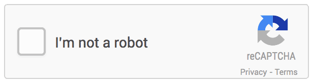

# Captcha

Captcha is a component that provides boot detection capabilities.
<br><br>

## Elements


## API

#### Component Props

| name        | type                             | defaultValue | isRequired | description                                                            |
|:------------|:---------------------------------|:-------------|:-----------|:-----------------------------------------------------------------------|
| sitekey     | string                           |              | yes        | The captcha has site key and server key for verification of the token  |
|             |                                  |              |            | This is the site key                                                   |
| size        | Size (enum of normal/compact)    | normal       | No         | Captcha size                                                           |
| captchaType | CaptchaType (enum of image/audio)| image        | No         | The type of the challenge we will provide the user                     |
| theme       | Theme (enum of light/dark)       | light        | No         | The color of the component                                             |
| onExpire    | function                         |              | No         | This callback is called when we the verified captcha was not submitted |
|             |                                  |              |            | in a reasonable time frame                                             |
| onVerify    | function                         |              | No         | This callback is called when we the captcha challenge is successful    |

#### Component API

| method name                 |  description                                                                        |
|:----------------------------|:------------------------------------------------------------------------------------|
| resetCaptcha()              |This method will reload the captcha internals and will invalid any prev token, 
|                               it is useful to deal with expired captcha                                           |
| verificationToken():String  | returns the verification token (String) we got from google or undefined             |
| isVerified():Boolean        | returns true if the captcha challenge has been successfully taken and not expired   |
| getTheme():Theme            | returns the theme of the captcha  Theme (enum of light/dark)                        |
| getSize():Size              | returns the size of the captcha  Size (enum of normal/compact)                      |


## General Behavior

The user is provided with a challenge to detect if it is a real person or a boot.
Google may present additional challenges to further verify the boot/human
The size and theme properties control the visual aspects of the captcha. 

## Technical Considerations

The captcha must have a server side verification api that deals with verifying the captcha token with the google api.
The supports  


### React Code Example

**Example 1:**

```jsx
//code example goes here
import * as React from 'react';
import {Captcha} from '../src/components/captcha';
import {Size,CaptchaType,Theme} from '../src/components/captcha/types';
const demoSiteKey = '6LeIxAcTAAAAAJcZVRqyHh71UMIEGNQ_MXjiZKhI';


class CaptchaExample extends React.Component {

    handleExpiration = () => {
    //disenable submit button
    };
    
    handleVerify = () => {
    //enable submit button
    };
    handleCaptchaVisible = () => {
    //do nothing
    };

    render() {
        return (
          <div>
            <Captcha
              sitekey={demoSiteKey}
              size={Size.compact}
              captchaType={CaptchaType.image}
              theme={Theme.dark}
              onVerify={()=> this.handleVerify()}
              onExpire={() => {this.handleExpiration())}}
            />
          </div>
        )
      }
    }
}
```

## Style API

### Style Code Example

## Accessibility & Keyboard Navigation

The captcha checkbox will have `tabIndex = 0` by default meaning it will be focusable and part of the keyboard navigation flow.<br>

